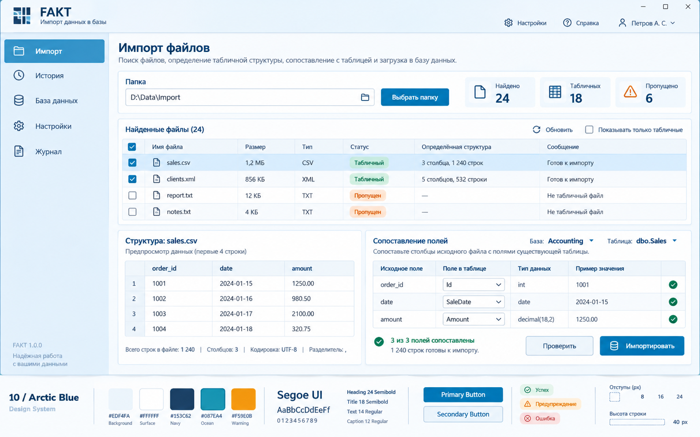

# FAKT — дизайн-система Arctic Blue

Версия: 1.0 · Дата: 24.09.2026 · Платформа: Windows / WPF · Тема: светлая.

## 1. Основа и назначение

Выбран вариант №10, Arctic Blue. Интерфейс предназначен для поиска файлов в выбранной папке, определения табличной структуры, сопоставления столбцов с полями существующей базы данных и импорта после проверки.

Визуальная основа: светлый ледяной фон, белые рабочие поверхности, тёмно-синие заголовки, морской синий акцент, ясные таблицы и крупные элементы управления.



Референс задаёт композицию и характер. Точные значения и поведение ниже являются спецификацией для реализации; состояния, отсутствующие на изображении, определены дополнительно. Нижняя полоса с палитрой на изображении — презентационный материал, а не часть окна приложения. Демонстрационные имена, числа и профиль пользователя не являются требованиями к продукту.

## 2. Принципы

- Данные занимают основную площадь: список файлов, предпросмотр и сопоставление доступны на одном рабочем экране.
- Насыщенный синий выделяет действия и текущий раздел; зелёный, янтарный и красный обозначают состояние.
- Статус всегда содержит текст; цвет и пиктограмма дополняют его.
- Расширение файла не гарантирует табличную структуру. TXT может быть табличным, а XML может потребовать выбора повторяющегося узла.
- Пропуск означает исключение из импорта. Исходные файлы не удаляются и не перемещаются.
- Схема базы уже существует. Интерфейс выбирает таблицу и сопоставляет поля, не создаёт их автоматически.
- Декоративные градиенты, сильные тени, стеклянные панели и анимация таблиц не используются. Мягкость референса передаётся цветами поверхностей.

## 3. Единицы и архитектура токенов

Все размеры в документе указаны в DIP — независимых от DPI единицах WPF. Размеры шрифта также задаются в DIP. Базовый шаг отступов — 4.

Токены организованы в три слоя:

1. **Primitive:** исходные цвета, размеры, длительности.
2. **Semantic:** назначение значения — фон, текст, действие, предупреждение.
3. **Component:** применение семантического значения в кнопке, таблице или поле.

Пример цепочки: `Color.Ocean.600` → `Brush.Action.Primary` → `Button.Primary.Background`. HEX-значения хранятся в словаре примитивов, а не дублируются в шаблонах контролов.

### 3.1. Палитра

| Primitive | HEX | Назначение |
|---|---|---|
| Color.Ice.50 | #EDF4FA | Основной ледяной фон из референса |
| Color.White | #FFFFFF | Белые панели и текст на основной кнопке |
| Color.Navy.800 | #153C62 | Заголовки и основной текст |
| Color.Ocean.600 | #087EA4 | Основной акцент из референса |
| Color.Ocean.700 | #066B8C | Наведение на основное действие |
| Color.Ocean.800 | #055570 | Нажатое основное действие |
| Color.Blue.50 | #F4F9FD | Заголовки таблиц, вторичные поверхности |
| Color.Blue.100 | #E3F0FA | Боковая панель, наведение на строку |
| Color.Blue.200 | #D3E9F8 | Выделенная строка |
| Color.Blue.300 | #C5DCEC | Разделители и границы панелей |
| Color.Slate.400 | #7894A8 | Граница интерактивного поля |
| Color.Slate.600 | #526B82 | Вторичный текст |
| Color.Slate.200 | #DDE6ED | Фон недоступного элемента |
| Color.Slate.500 | #64788A | Текст недоступного элемента |
| Color.Green.700 | #08785D | Текст и значок успеха |
| Color.Green.50 | #E4F5ED | Подложка успеха |
| Color.Amber.500 | #F59E0B | Предупреждающий акцент из референса |
| Color.Amber.800 | #92400E | Читаемый текст предупреждения |
| Color.Amber.50 | #FFF3DB | Подложка предупреждения |
| Color.Red.700 | #B42332 | Текст, значок и граница ошибки |
| Color.Red.50 | #FDECEF | Подложка ошибки |

Янтарный #F59E0B не применяется для мелкого текста на белом фоне: для текста используется #92400E.

### 3.2. Семантические ресурсы

| Ключ WPF | Primitive |
|---|---|
| Brush.Background.App | Color.Ice.50 |
| Brush.Background.Surface | Color.White |
| Brush.Background.Subtle | Color.Blue.50 |
| Brush.Background.Navigation | Color.Blue.100 |
| Brush.Text.Primary | Color.Navy.800 |
| Brush.Text.Secondary | Color.Slate.600 |
| Brush.Text.OnAction | Color.White |
| Brush.Border.Subtle | Color.Blue.300 |
| Brush.Border.Input | Color.Slate.400 |
| Brush.Action.Primary | Color.Ocean.600 |
| Brush.Action.Hover | Color.Ocean.700 |
| Brush.Action.Pressed | Color.Ocean.800 |
| Brush.Focus | Color.Ocean.600 |
| Brush.Selection | Color.Blue.200 |
| Brush.Disabled.Background | Color.Slate.200 |
| Brush.Disabled.Foreground | Color.Slate.500 |
| Brush.Status.Success / Brush.Status.SuccessBackground | Color.Green.700 / Color.Green.50 |
| Brush.Status.Warning / Brush.Status.WarningBackground | Color.Amber.800 / Color.Amber.50 |
| Brush.Status.Error / Brush.Status.ErrorBackground | Color.Red.700 / Color.Red.50 |

### 3.3. Геометрия

| Токен | Значение | Применение |
|---|---|---|
| Space.1 / Space.2 / Space.3 | 4 / 8 / 12 | Мелкие интервалы и содержимое контролов |
| Space.4 / Space.6 / Space.8 | 16 / 24 / 32 | Панели, края рабочей области, крупные секции |
| Radius.Control | 6 | Кнопки и поля |
| Radius.Panel | 6 | Рабочие панели |
| Radius.Badge | 10 | Статусные метки |
| Border.Default | 1 | Границы |
| Border.Focus | 2 | Видимый фокус клавиатуры |
| Size.Control | 40 | Стандартная высота кнопки и поля |
| Size.Control.Compact | 32 | Поле сопоставления внутри строки |
| Size.Table.Row | 40 | Минимальная высота строки |
| Size.Table.Header | 36 | Минимальная высота заголовка таблицы |
| Size.Icon.Small / Size.Icon.Default | 16 / 20 | Таблица / кнопка |
| Size.Icon.Navigation | 24 | Боковая навигация |

Панели имеют внутренний отступ 16. Между панелями — 16; между заголовком и содержимым — 12. Основная рабочая область имеет внешние отступы 24. Тени по умолчанию отсутствуют.

## 4. Типографика и пиктограммы

Основной шрифт — **Segoe UI**, с поддержкой кириллицы. Числа в таблицах используют табличные цифры, когда гарнитура поддерживает их. Моноширинный шрифт не применяется ко всему интерфейсу.

| Стиль | Размер | Насыщенность | Применение |
|---|---|---|---|
| Display.Brand | 28 | Semibold | Название FAKT |
| Heading.Page | 24 | Semibold | «Импорт файлов» |
| Heading.Section | 18 | Semibold | Заголовки панелей |
| Body | 14 | Normal | Поля, таблицы, пояснения |
| Label | 14 | Semibold | Кнопки и значимые подписи |
| Caption | 12 | Normal | Метаданные и вспомогательный текст |
| Metric | 24 | Semibold | Счётчики найденных файлов |

Для многострочного текста ориентир межстрочного интервала — 1,4 размера шрифта. Подписи не пишутся целиком прописными буквами. Длинные пути и имена допускают обрезку с многоточием; полное значение доступно в подсказке и при копировании.

Пиктограммы контурные, одного семейства, с визуальной толщиной линии около 1,5–2 DIP. Предпочтительно хранить их как векторные ресурсы. Основные образы: папка, документ, таблица, база данных, обновление, настройки, журнал, проверка и предупреждение. Эмодзи не используются как иконки интерфейса.

## 5. Компоновка окна

Основной ориентир — окно 1440 × 900 DIP. Минимальный поддерживаемый размер — 1024 × 720 DIP. Размеры описывают логическую компоновку, а не фиксированное разрешение экрана.

### 5.1. Постоянные области

- Системные кнопки окна и стандартное поведение Windows сохраняются. При собственной шапке обеспечиваются перетаскивание и изменение размеров.
- Шапка продукта высотой около 64 содержит знак FAKT, название и краткую подпись «Импорт данных в базу»; справа — настройки и справку. Профиль показывается только при наличии реальной авторизации.
- Боковая панель шириной 216 содержит разделы «Импорт», «История», «База данных», «Настройки», «Журнал». Активный пункт имеет синий фон и белые текст и значок.
- «История» содержит результаты запусков импорта; «Журнал» — подробные диагностические события.

### 5.2. Экран импорта

Сверху вниз:

1. Заголовок «Импорт файлов» и одно предложение о назначении экрана.
2. Панель источника: подпись «Папка», поле пути, кнопка «Выбрать папку», счётчики «Найдено», «Табличных», «Пропущено».
3. Панель «Найденные файлы»: заголовок, обновление списка, фильтр «Показывать только табличные», таблица.
4. Две нижние панели: слева предпросмотр выбранного файла, справа сопоставление с таблицей БД. Начальная пропорция ширины 42:58, между ними доступный с клавиатуры GridSplitter.
5. В нижней части сопоставления — результат проверки, кнопки «Проверить» и «Импортировать».

При ширине окна менее 1280 DIP навигация сокращается до полосы 64 DIP с подсказками и доступными именами. Нижние панели располагаются вертикально, сначала предпросмотр, затем сопоставление. Счётчики переносятся на отдельную строку. Действия не перекрывают содержимое.

Таблицы получают ограниченную доступную высоту и собственную прокрутку. На узком окне для набора нижних панелей допускается отдельная вертикальная прокрутка; не оборачивать всю страницу вместе со всеми DataGrid в один неограниченный ScrollViewer.

## 6. Компоненты и состояния

### 6.1. Кнопки

Высота 40, горизонтальный padding 16, радиус 6. Между иконкой и текстом — 8. Ширина определяется содержимым. «Импортировать» — основное действие; «Проверить» — вторичное. «Выбрать папку» может быть основным действием внутри панели источника.

| Вариант | Default | Hover | Pressed | Disabled |
|---|---|---|---|---|
| Primary: фон | Action.Primary | Action.Hover | Action.Pressed | Disabled.Background |
| Primary: текст | Text.OnAction | Text.OnAction | Text.OnAction | Disabled.Foreground |
| Secondary: фон | Background.Surface | Background.Subtle | Selection | Disabled.Background |
| Secondary: текст | Text.Primary | Text.Primary | Text.Primary | Disabled.Foreground |

У вторичной кнопки граница Border.Input. Фокус — отдельная рамка Focus толщиной 2 с внешним отступом 2, не меняющая размер элемента. Во время операции показываются индикатор и глагол процесса, например «Проверка…». Повторное выполнение блокируется.

### 6.2. TextBox и ComboBox

- Белая поверхность, граница Border.Input, радиус 6, высота 40, внутренний отступ по горизонтали 12.
- Постоянная подпись над полем; placeholder не заменяет подпись.
- Hover усиливает границу акцентным цветом; focus добавляет рамку 2 DIP.
- Ошибка: красная граница, значок и пояснение рядом или под полем. Фокус остаётся различимым поверх состояния ошибки.
- Read-only сохраняет читаемость текста и позволяет копирование; disabled использует отдельные цвета недоступности.
- ComboBox полей базы показывает имя и тип. Тип целевого поля берётся из схемы и не редактируется как свойство базы.
- При большом числе таблиц или полей выпадающий список поддерживает поиск.

### 6.3. Таблица найденных файлов

Колонки: выбор, имя файла, размер, тип, статус, определённая структура, сообщение. Имя и сообщение получают гибкую ширину; служебные колонки сохраняют минимальную достаточную ширину.

- Header: Background.Subtle, Label, высота не менее 36.
- Строка: белый фон, высота не менее 40, горизонтальные разделители Border.Subtle.
- Hover: Background.Navigation; выбранная строка: Selection.
- Активный файл для предпросмотра и флажок включения в импорт — разные состояния. Нажатие на строку меняет предпросмотр, флажок управляет включением в пакет.
- Общий флажок имеет три состояния; массовый выбор действует на видимые доступные строки. Скрытые выбранные файлы учитываются в явном счётчике общего выбора.
- Пропущенные файлы видны с причиной, но не могут быть включены в импорт до устранения причины.
- Имена и текст выравниваются влево, числовые значения — вправо. Единицы размера отображаются последовательно.
- Сортировка обозначается в заголовке. Полный текст обрезанной ячейки доступен через подсказку и копирование.

### 6.4. Предпросмотр

Заголовок: «Структура: sales.csv». Под ним: «Показаны первые 100 строк». Предпросмотр ограничен по объёму и не заменяет полную проверку.

Под таблицей показываются число строк, число столбцов, кодировка и, если применим, разделитель. Пока полное число строк неизвестно, выводится «Подсчёт…», а не вымышленное значение. Для XML вместо разделителя показывается выбранный путь к повторяющимся записям.

Пустое значение, пустая строка и NULL должны различаться: NULL отображается отдельной меткой с пояснением. Предпросмотр по умолчанию доступен только для чтения.

### 6.5. Сопоставление полей

Вверху — селекторы существующей базы и таблицы. Колонки: «Исходное поле», «Поле в таблице», «Тип данных», «Пример значения», статус.

Автосопоставление является предложением: пользователь может изменить целевое поле. Один исходный столбец можно исключить. Несколько исходных столбцов нельзя назначить одному целевому полю без явно поддерживаемого преобразования.

Проверяются обязательные поля, допустимость NULL, длины строк, типы и формат дат и чисел. Вычисляемые и автоматически заполняемые поля обозначаются отдельно. Показываются как успешные соответствия, так и обязательные поля назначения без источника.

Для файлов с разными структурами сопоставления настраиваются отдельно или группируются по одинаковой структуре. В панели явно указывается текущий файл или группа; настройки sales.csv не переносятся молча на clients.xml.

### 6.6. Статусы

| Статус | Оформление | Значение |
|---|---|---|
| Табличный | Зелёная метка | Структура распознана; проверка импорта ещё может требоваться |
| Пропущен | Янтарная метка | Не подходит для текущего импорта; рядом причина |
| Требует настройки | Янтарная метка | Нужно указать параметры разбора или сопоставления |
| Ошибка | Красная метка | Файл не прочитан либо обнаружена блокирующая ошибка |
| Готов к импорту | Зелёная метка с галочкой | Текущая конфигурация прошла проверку |
| Импортирован | Зелёная метка с галочкой | Сохранение подтверждено результатом операции |

Метки: высота не менее 24, padding 8 по горизонтали, шрифт 12. Статусный цвет применяется к тексту и значку на светлой подложке соответствующей категории.

## 7. Сценарий и обратная связь

| Состояние | Содержимое | Доступное действие |
|---|---|---|
| Папка не выбрана | «Выберите папку с файлами для импорта» | Выбрать папку |
| Поиск | Путь, число уже найденных файлов, индикатор | Отменить поиск |
| Ничего не найдено | «В папке нет подходящих файлов» с пояснением условий поиска | Изменить папку / обновить |
| Анализ завершён | Таблицы, счётчики, причины пропуска | Настроить структуру и сопоставление |
| Проверка | Прогресс и текущий файл | Отменить проверку |
| Есть ошибки | Сводка и переход к конкретной строке или полю | Исправить и повторить проверку |
| Готово | Число проверенных строк и выбранное назначение | Импортировать |
| Импорт | Подтверждённые счётчики обработанных и сохранённых строк | Отмена, только если поддерживается |
| Завершено | Сохранено / пропущено / ошибок, ссылка на подробности | Открыть результат |

«Импортировать» доступна, когда выбран хотя бы один подходящий файл, доступна целевая таблица, обязательные поля сопоставлены и проверка текущей конфигурации завершена без блокирующих ошибок. Изменение источника, настроек разбора, назначения или сопоставления сбрасывает готовность и требует новой проверки.

Статусы и числа берутся из реального результата. Отмена или частичный сбой не отображаются как полный успех. После ошибки показывается, какие данные успели сохраниться и что можно повторить; интерфейс не обещает откат без подтверждения от слоя импорта.

Ошибки содержат причину и следующий шаг: «Строка 128: значение “abc” нельзя преобразовать в Amount (decimal). Исправьте источник или настройку преобразования». Общий toast не заменяет ошибку возле соответствующего поля.

## 8. Доступность и клавиатура

- Целевые требования контраста: обычный текст не ниже 4,5:1, крупный текст и значимые границы интерактивных элементов — не ниже 3:1. Проверить итоговые сочетания и состояния при реализации; это критерии приёмки, а не результат аудита изображения.
- Порядок Tab соответствует порядку работы: навигация, источник, список файлов, предпросмотр, назначение, сопоставление, проверка и импорт.
- Space переключает флажок; стрелки перемещают по таблице; Enter активирует сфокусированный элемент. «Импортировать» не назначается глобальной кнопкой по умолчанию.
- Escape закрывает выпадающий список или диалог; отмена фоновой операции должна быть явным действием.
- У иконок без текста есть tooltip и AutomationProperties.Name. У полей есть доступные подписи; у ошибок — текстовое описание.
- Пользовательский масштаб текста не приводит к обрезке: фиксированные высоты заменяются минимальными там, где текст может увеличиваться.
- Проверить DPI 100%, 125%, 150%, 200%, системный высокий контраст и полностью клавиатурное управление.

## 9. Движение

Hover и focus меняются за 100–150 мс. Появление небольшого уведомления — до 180 мс. Анимация не меняет размеры элементов и не сдвигает таблицы. Учитывается системное отключение анимаций.

Если объём работы неизвестен, используется неопределённый индикатор. Процент показывается только при известном общем объёме. Обновления прогресса не должны блокировать ввод.

## 10. Реализация в WPF

Рекомендуемая будущая структура ресурсов:

```text
Themes/
  ArcticBlue.Primitives.xaml
  ArcticBlue.Semantic.xaml
  ArcticBlue.Metrics.xaml
  ArcticBlue.Typography.xaml
  Controls/
    Buttons.xaml
    Inputs.xaml
    DataGrid.xaml
    Navigation.xaml
    StatusBadge.xaml
  ArcticBlue.xaml
```

- Цвета объявляются как Color, семантические цвета — как SolidColorBrush. Размеры, Thickness и CornerRadius — типизированные ресурсы.
- Словари подключаются от примитивов к семантике, затем к стилям компонентов. Для подменяемых системных и тематических ресурсов используется DynamicResource; неизменяемые размеры могут использовать StaticResource.
- Компонентные стили имеют явные ключи: Button.Primary, Button.Secondary, TextBox.Default, ComboBox.Default, DataGrid.Files, DataGrid.Preview, DataGrid.Mapping, Navigation.Item, StatusBadge.Default.
- ControlTemplate кнопок и полей реализует радиусы и состояния. У стандартной WPF Button нет собственного свойства CornerRadius: оно применяется к Border внутри шаблона.
- Фокус, hover, pressed, disabled, selected и validation error задаются в шаблонах и триггерах с предсказуемым приоритетом. Disabled блокирует hover и pressed; рамка клавиатурного фокуса не теряется при ошибке.
- DataGrid сохраняет виртуализацию строк и столбцов и recycling. Большие файлы читаются с ограниченным предпросмотром; весь файл не загружается в UI ради отображения первых строк.
- Разбор и импорт выполняются вне потока UI. Команды, возможность выполнения и состояние операции поступают из ViewModel; визуальные шаблоны не содержат бизнес-логику.
- UseLayoutRounding и SnapsToDevicePixels используются для чётких границ с проверкой на разных DPI.
- Тексты вынесены в ресурсы локализации. Русские даты и числа отображаются последовательно; формат разбора исходного файла задаётся отдельно от формата отображения.

## 11. Критерии приёмки

- [ ] Экран сохраняет композицию Arctic Blue: голубая навигация, белые панели, синие действия, предпросмотр и сопоставление снизу.
- [ ] Палитра, отступы, размеры и шрифты используют общие ресурсы.
- [ ] Все кнопки, поля и строки имеют различимые интерактивные состояния.
- [ ] Экран пригоден к работе при 1024 × 720 DIP; на большом окне пространство получают таблицы.
- [ ] Текст и действия не обрезаются при увеличении DPI и текста.
- [ ] Поиск, пустые результаты, ошибки, проверка, частичный импорт и завершение имеют отдельные состояния.
- [ ] Структура определяется по содержимому; пропущенные файлы не удаляются.
- [ ] Сопоставление соответствует текущему файлу или группе одинаковой структуры и существующей схеме БД.
- [ ] Любое изменение конфигурации отменяет результат предыдущей проверки.
- [ ] Импорт нельзя запустить повторно во время операции.
- [ ] Контраст, клавиатура и доступные имена проверены на реализованных контролах.
- [ ] Генераторные неточности референса, демонстрационные счётчики и фиктивный профиль не перенесены в продукт.

## 12. Материалы

- Визуальная основа: [10-arctic-blue.png](design-concepts/10-arctic-blue.png).
- Исходные запросы генерации: [prompts.json](design-concepts/prompts.json), вариант 10.
- Эта спецификация описывает одну светлую тему. XAML-ресурсы и рабочее приложение создаются на её основе отдельно.
